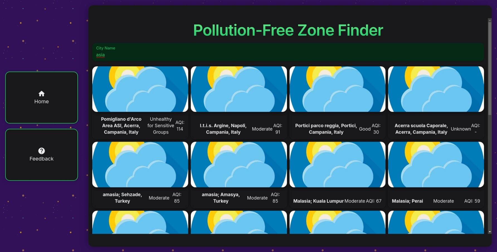

# Pollution-Free Zone Finder

This repository contains the project files for Pollution-Free Zone Finder, a small project built at the `HackWithVertos` event hosted by [Lovely Professional University](https://www.lpu.in/).

## Demo

Live demo: [https://pollution-free-zone-finder.vercel.app/](https://pollution-free-zone-finder.vercel.app/)

## Screenshots



## Requirements

Before getting started, ensure you have the following installed:

- [Node.js](https://nodejs.org/)
- [PNPM](https://pnpm.io/)

## Usage

1. Clone this repository to your local machine.

   ```bash
   git clone https://github.com/a0v0/pollution-free-zone-finder.git
   ```

2. Navigate to the project directory.

   ```bash
   cd pollution-free-zone-finder
   ```

3. Install dependencies using PNPM.
   ```bash
   pnpm install
   ```
4. Run the development server.

   ```bash
   pnpm dev
   ```

## License

This project is licensed under the [MIT License](LICENSE).
